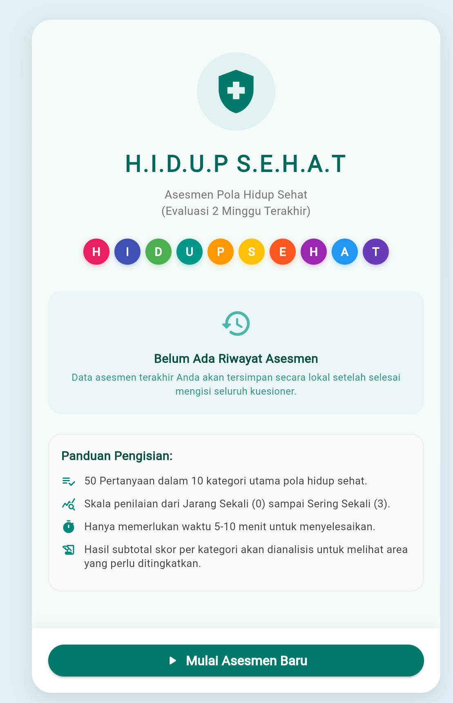
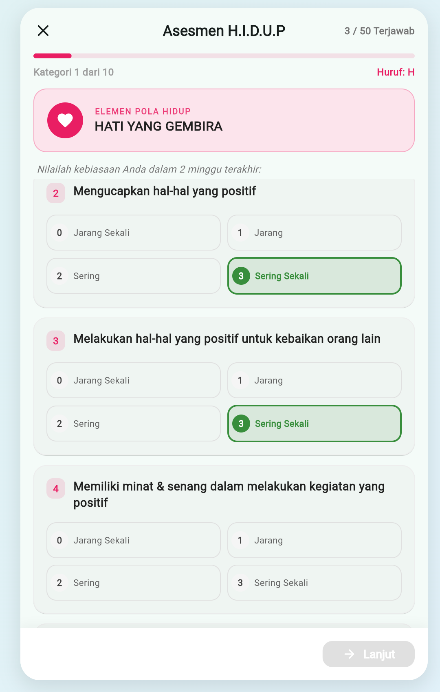
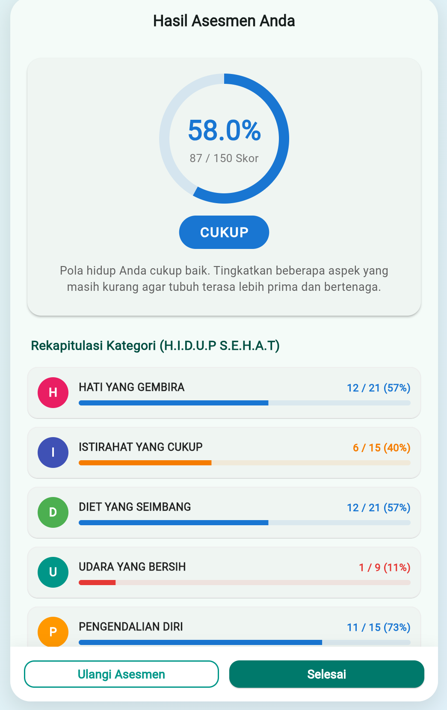

# H.I.D.U.P S.E.H.A.T Lifestyle Assessment

[](https://flutter.dev)
[](https://dart.dev)
[](https://flutter.dev/multi-platform/web)
[](https://flutter.dev/multi-platform/android)
[](LICENSE)

An interactive, mobile-first Web Application designed to assess and monitor healthy lifestyle habits over a two-week period. This application digitizes a comprehensive 50-question assessment protocol into a highly interactive, responsive experience.

---

## Project Overview

The objective of **H.I.D.U.P S.E.H.A.T** is to convert a static paper-based health questionnaire into a high-utility, friction-free digital assessment tool. Traditionally, long health assessments suffer from high user drop-off rates due to cognitive fatigue. By utilizing a mobile-first Single Page Application (SPA) workflow, the assessment is broken down into structured, visually engaging categories that keep the interface clean and the user focused.

The assessment measures 10 fundamental lifestyle dimensions represented by the Indonesian acronym **H.I.D.U.P S.E.H.A.T**:
1. **H**ati yang Gembira (Joyful Heart)
2. **I**stirahat yang Cukup (Adequate Rest)
3. **D**iet yang Seimbang (Balanced Diet)
4. **U**dara yang Bersih (Fresh Air)
5. **P**engendalian Diri (Self-Control)
6. **S**inar Matahari yang Cukup (Adequate Sunlight)
7. **E**nerjik Berolahraga (Energetic Exercise)
8. **H**ubungan Sosial yang Baik (Good Social Relationships)
9. **A**ir Jernih yang Cukup (Adequate Clean Water)
10. **T**uhan yang Terutama (Spiritual Connection)

---

## Key Features

* **Structured Category Stepper**: Splitting the 50 questions into 10 cohesive categories using a dynamic `PageView`. This avoids scroll-fatigue and limits the screen to a few relevant, readable items at a time.
* **Touch-Friendly UI Options**: Traditional radio buttons are replaced by large, responsive 2x2 grid selectors. These tap-targets are color-coded (Red, Orange, Blue, Green) to reflect the habits' quality levels, giving immediate cognitive feedback.
* **Real-time Scoring Engine**: The client-side logic calculates overall scoring dynamically (out of a maximum 150 points). Scores are translated to a percentage and map to a clear classification:
  * **0% - 25%**: Buruk (Poor - Red)
  * **26% - 50%**: Kurang (Insufficient - Orange)
  * **51% - 75%**: Cukup (Fair - Blue)
  * **76% - 100%**: Baik (Good - Green)
* **Detailed Category Breakdown (Rekapitulasi)**: The result page includes a subtotal progress bar for each of the 10 categories, letting users instantly isolate specific lifestyle weaknesses that need adjustment.
* **Local State Persistence**: Utilizes `shared_preferences` to persist assessment history locally on the user's browser or device storage, removing the need for a remote backend database.

---

## Architecture & Tech Stack

This project is built using a **Zero-Cost Infrastructure** philosophy, ensuring it can scale to thousands of users without incurring server costs:

* **Flutter SDK & Dart**: Employs a single codebase optimized for the web build targets, with compile-ready configurations for Android.
* **Material Design 3**: A clean, contemporary visual design built using Material 3 specifications. Color palettes dynamically adapt as the user swipes through different categories (e.g., Pink accent for Heart, Indigo for Rest, Green for Diet).
* **Client-Only Architecture**: All computations, validation checks, and state transitions occur entirely in the client-side environment.
* **Local Storage Persistence**: The local device database caches the user's last assessment history. This architecture guarantees user data privacy since personal inputs never leave the browser.
* **Responsive Visual Frame**: On desktop browsers, the application is presented inside an elegant phone mockup container against a soft gradient backdrop, preserving the touch-focused user experience.

---

## Screenshots

| Home Screen | Questionnaire Screen | Results Screen |
| :---: | :---: | :---: |
|  |  |  |

---

## Getting Started

Follow these instructions to clone, build, and run the project locally on your machine.

### Prerequisites

* [Flutter SDK](https://docs.flutter.dev/get-started/install) (Stable Channel)
* Google Chrome (for running Web target)

### Installation & Run

1. **Clone the repository:**
   ```bash
   git clone https://github.com/rafifind/kuesioner_sehat.git
   cd kuesioner_sehat
   ```

2. **Retrieve project dependencies:**
   ```bash
   flutter pub get
   ```

3. **Launch the development server on Chrome:**
   ```bash
   flutter run -d chrome
   ```

4. **Build production web assets:**
   ```bash
   flutter build web
   ```
